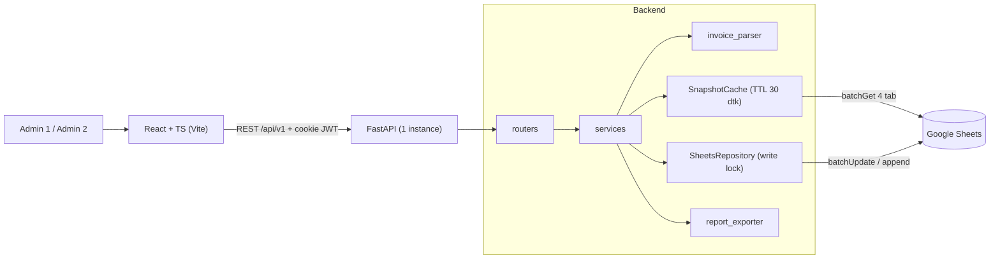
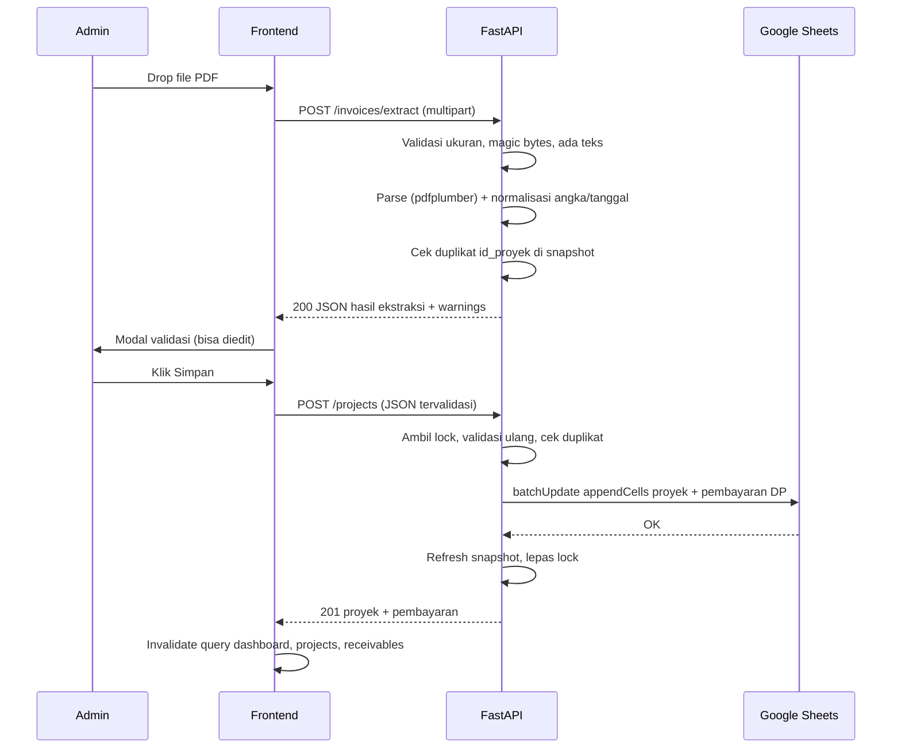
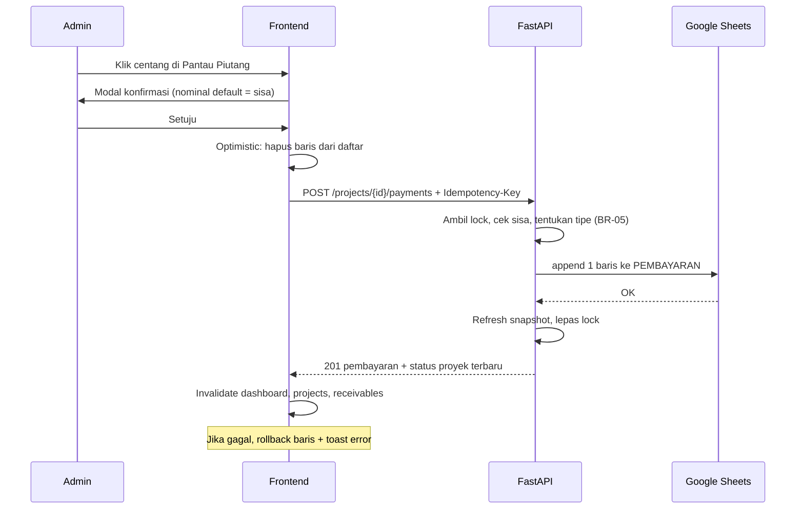

# PRODUCT REQUIREMENTS DOCUMENT (PRD)
# Dashboard Keuangan AGUNGJAYA ALUMINIUM

| Atribut | Nilai |
| :---- | :---- |
| **Versi** | 2.0 (revisi besar dari v1.0) |
| **Status** | Draft untuk implementasi |
| **Pemilik Produk** | Admin 1 & Admin 2 (pemilik usaha) |
| **Dokumen terkait** | Prototype `fe-dashboard/dashboard_agungjaya_aluminium (11).html`, contoh invoice `be-dashboard/Invoice - BPK YUSUF.pdf` |
| **Repositori** | `be-dashboard` (FastAPI), `fe-dashboard` (React + TypeScript) |

### Riwayat Perubahan

| Versi | Perubahan |
| :---- | :---- |
| 1.0 | Draft awal: 3 tab Sheets, 3 alur sistem. |
| 2.0 | Definisi metrik keuangan dipertegas (Omzet vs Kas Masuk). Tab `PEMBAYARAN` ditambahkan (ledger). Pelunasan menjadi append-only. API membaca dari snapshot ter-cache, bukan dari `REKAP_DASHBOARD`. Autentikasi 2 admin. Fitur laporan/export. Nomor invoice unik dari generator. Strategi konkurensi, cache, error, pengujian, dan fase pengerjaan. |

---

## 1. Ringkasan Eksekutif

### 1.1 Konteks
AGUNGJAYA ALUMINIUM adalah usaha instalasi aluminium dan kaca (Duren Sawit, Jakarta Timur) dengan proyek yang berjalan terus-menerus. Invoice dibuat lewat **invoice generator** milik sendiri (`agungjaya-invoice-generator.vercel.app`) dan diekspor sebagai PDF. Saat ini pencatatan tagihan, status piutang (DP/Lunas), dan pengeluaran harian dilakukan manual sehingga rawan salah catat dan sulit dipantau.

Pola pembayaran umum: **DP 30–50%, lalu pelunasan sekaligus** pada pembayaran kedua. Pembayaran cicilan lebih dari dua kali jarang terjadi, tetapi harus tetap bisa dicatat.

### 1.2 Tujuan Produk
Membangun dashboard keuangan internal berbasis web yang:

1. **Mengekstrak otomatis** data dari PDF invoice (nomor invoice, klien, tanggal, subtotal, diskon, DP, sisa).
2. **Mencatat** proyek, pembayaran, dan pengeluaran ke Google Sheets sebagai database yang transparan dan bisa diedit manual.
3. **Memvisualisasikan** omzet, kas masuk, pengeluaran, laba bersih, dan piutang per bulan secara cepat.
4. **Mengamankan** pelunasan lewat konfirmasi, dan menjamin tidak ada data ganda atau tertimpa.
5. **Menghasilkan laporan** bulanan/tahunan (XLSX dan PDF) serta akses cepat ke spreadsheet sumber.

### 1.3 Non-Tujuan (Out of Scope v1)
- Edit dan hapus data dari aplikasi. Koreksi dilakukan manual di Google Sheets, lalu tombol **Sinkronkan** di aplikasi menarik data terbaru.
- Multi-tenant, role bertingkat, atau lebih dari 2 pengguna.
- Pembuatan invoice (sudah ditangani invoice generator terpisah).
- Pajak (PPN/PPh), stok barang, dan penggajian detail.
- Scale-out multi-instance. Sistem dirancang untuk **1 instance backend** (lihat 6.5).

### 1.4 Metrik Keberhasilan

| Metrik | Target |
| :---- | :---- |
| Waktu input satu invoice (upload → tersimpan) | < 30 detik |
| Respons GET dashboard (cache hit) | p95 < 200 ms |
| Respons GET dashboard (cache miss, baca Sheets) | p95 < 2 detik |
| Akurasi ekstraksi PDF pada invoice dari generator | 100% pada field wajib (dengan validasi manual sebagai pengaman) |
| Data ganda / tertimpa akibat penulisan bersamaan | 0 |
| Read request ke Google Sheets per menit (beban normal) | < 10 |

---

## 2. Persona & Hak Akses

| Persona | Deskripsi | Akses |
| :---- | :---- | :---- |
| **Admin 1** | Pemilik usaha | Semua fitur |
| **Admin 2** | Pemilik usaha (kakak) | Semua fitur |

Kedua admin memiliki hak yang sama. Perbedaan akun dipakai untuk **jejak audit**: setiap baris yang ditulis aplikasi mencatat `dibuat_oleh` / `dicatat_oleh` (`admin1` atau `admin2`).

---

## 3. Definisi Domain & Metrik Keuangan

Bagian ini adalah **sumber kebenaran tunggal** untuk semua perhitungan. FE, BE, dan laporan wajib mengikuti definisi ini.

### 3.1 Glosarium

| Istilah | Definisi |
| :---- | :---- |
| **Proyek** | Satu invoice = satu proyek. Diidentifikasi oleh nomor invoice. |
| **Subtotal** | Jumlah semua item pesanan sebelum diskon. |
| **Diskon** | Potongan harga (Rp), default 0. |
| **Nilai Proyek** | `subtotal − diskon`. Total kontrak yang harus dibayar klien. |
| **Pembayaran** | Satu transaksi uang masuk dari klien (DP, cicilan, atau pelunasan), dengan tanggal sendiri. |
| **Total Dibayar** | Σ nominal pembayaran suatu proyek. |
| **Sisa Piutang (proyek)** | `nilai_proyek − total_dibayar`. |
| **Status Bayar** | `LUNAS` jika sisa piutang ≤ 0, selain itu `DP`. Status **dihitung**, tidak diinput. |

### 3.2 Rumus KPI

Semua nilai bertipe **integer Rupiah**. Bulan memakai zona waktu **Asia/Jakarta**.

| KPI | Rumus | Dikelompokkan berdasarkan |
| :---- | :---- | :---- |
| **Omzet bulan M** (Pemasukan Kotor) | Σ `nilai_proyek` proyek yang `tanggal`-nya di bulan M | Tanggal invoice |
| **Kas Masuk bulan M** | Σ `nominal` pembayaran yang `tanggal`-nya di bulan M | Tanggal pembayaran |
| **Total Pengeluaran bulan M** | Σ `nominal` pengeluaran bulan M | Tanggal pengeluaran |
| **Laba Bersih bulan M** | `Kas Masuk − Total Pengeluaran` | Berbasis kas (uang nyata) |
| **Margin Laba bulan M** | `Laba Bersih / Kas Masuk × 100`, `null` jika Kas Masuk = 0 | |
| **Sisa Piutang (global)** | Σ `max(nilai_proyek − total_dibayar, 0)` seluruh proyek | **Tidak difilter bulan** |
| **Omzet All-Time** | Σ `nilai_proyek` seluruh proyek | |
| **Tren vs bulan lalu** | `delta = nilai_M − nilai_(M−1)`; `delta_pct = delta / nilai_(M−1) × 100`, `null` jika pembanding 0 | |

**Alasan basis kas untuk laba:** DP dan pelunasan sering jatuh di bulan berbeda. Jika laba dihitung dari omzet, laba bulan DP tampak besar padahal uangnya baru sebagian diterima, sementara pengeluaran bahan baku sudah keluar di depan. Omzet tetap ditampilkan untuk melihat nilai bisnis yang masuk.

### 3.3 Contoh Perhitungan (invoice BPK YUSUF, 3 Okt 2026)
Subtotal 21.700.000, diskon 700.000, DP 10.000.000.
- Nilai Proyek = **21.000.000** (masuk Omzet Okt 2026).
- Pembayaran DP 10.000.000 tanggal 03/10/2026 (masuk Kas Masuk Okt 2026).
- Sisa Piutang = **11.000.000**, status **DP**.
- Jika pelunasan 11.000.000 dibayar 20 Nov 2026: Kas Masuk Nov 2026 bertambah 11.000.000, Omzet Nov tidak berubah, piutang proyek menjadi 0 dan status **LUNAS**.

### 3.4 Aturan Bisnis

| Kode | Aturan |
| :---- | :---- |
| BR-01 | `nilai_proyek = subtotal − diskon`. Nilai ini dipakai, bukan subtotal. |
| BR-02 | Status bayar selalu hasil hitung dari pembayaran. Teks "DP" di PDF diabaikan. |
| BR-03 | Pembayaran tidak boleh melebihi sisa piutang (tidak ada overpay). |
| BR-04 | Nominal pembayaran harus > 0 (integer). |
| BR-05 | Tipe pembayaran otomatis: `DP` untuk pembayaran pertama saat invoice disimpan, `PELUNASAN` jika nominal = sisa saat itu, selain itu `CICILAN`. |
| BR-06 | Nomor invoice harus unik. Invoice dengan nomor yang sudah ada ditolak (409). |
| BR-07 | Invoice tanpa nomor yang valid ditolak saat ekstraksi, dengan pesan jelas. |
| BR-08 | Jika DP di PDF = 0, tidak ada baris pembayaran dibuat. Proyek berstatus DP dengan total dibayar 0. |
| BR-09 | Jika DP di PDF = nilai proyek, proyek langsung `LUNAS`. |
| BR-10 | Kategori pengeluaran hanya salah satu dari enum yang ditetapkan. |

---

## 4. Spesifikasi Teknologi

### 4.1 Stack

| Lapisan | Teknologi | Catatan |
| :---- | :---- | :---- |
| **Frontend** | React 19, TypeScript (strict), Vite | Sudah di-scaffold di `fe-dashboard` |
| Styling | Tailwind CSS v4 | `@tailwindcss/vite` sudah terpasang |
| State server | TanStack Query | Cache, invalidasi, optimistic update |
| Routing | React Router | |
| Form & validasi | React Hook Form + Zod | |
| Grafik | Chart.js via `react-chartjs-2` | Sama dengan prototype |
| Ikon | `lucide-react` | Sudah terpasang (prototype memakai Phosphor, hanya pengganti visual) |
| Tipe API | `openapi-typescript` | Tipe FE dibangkitkan dari OpenAPI FastAPI |
| **Backend** | Python 3.12, FastAPI, Pydantic v2 | Microservice API |
| Server | Uvicorn, **1 worker** | Lihat 6.5 |
| Parsing PDF | `pdfplumber` | Berbasis aturan, bukan AI |
| Akses Sheets | `gspread` + `google-auth` | Service Account |
| Auth | `PyJWT` (JWT) + `bcrypt` | Dipakai langsung, tanpa passlib/python-jose |
| Rate limit | Limiter in-memory (`app/core/rate_limit.py`) | Untuk login. Cukup untuk 1 instance (lihat 6.5). |
| Export | `openpyxl` (XLSX), `reportlab` (PDF) | `reportlab` murni Python, mudah di Windows |
| Pengujian BE | `pytest`, `pytest-asyncio`, `httpx` | |
| Pengujian FE | Vitest, Testing Library, MSW | |
| **Database** | Google Sheets (`DB_Agungjaya`) | 4 tab |

### 4.2 Arsitektur Tingkat Tinggi



Prinsip desain:

1. **Layered:** `router` (HTTP + validasi) → `service` (logika bisnis) → `repository` (satu-satunya yang mengenal gspread). Mengganti Sheets dengan PostgreSQL kelak hanya mengganti repository.
2. **Read dari snapshot, write lewat lock.** Semua pembacaan dilayani dari satu snapshot di memori. Semua penulisan diserialisasi.
3. **Append-only untuk uang.** Pembayaran tidak pernah mengubah baris lama.
4. **Backend adalah penghitung tunggal.** Semua KPI dihitung di service dari snapshot. Rumus di Sheets hanya untuk dilihat manual.
5. **Kontrak tipe tunggal.** Skema Pydantic → OpenAPI → tipe TypeScript.

---

## 5. Arsitektur Data (Google Sheets)

Satu spreadsheet `DB_Agungjaya`. **Locale: Indonesia, Timezone: Asia/Jakarta.**

### 5.1 Konvensi

| Topik | Aturan |
| :---- | :---- |
| Penulisan oleh backend | `valueInputOption=RAW` agar Sheets tidak menafsirkan ulang nilai/tanggal sesuai locale |
| Tanggal | String ISO `YYYY-MM-DD` |
| Uang | Angka integer (bukan teks, tanpa `Rp` dan pemisah ribuan) |
| `bulan_filter` | Format **`YYYY-MM`** (dapat diurutkan, tanpa ambiguitas). Menggantikan `MM-YYYY` pada PRD v1. |
| Kolom input vs turunan | Kolom **input** (ditulis backend) ditempatkan di kiri. Kolom **turunan** (rumus) ditempatkan di kanan, agar `append` tidak menabrak rumus. |
| Baris 1 | Header, dibekukan (freeze) |
| Validasi data | Dropdown untuk `tipe` dan `kategori` (dibuat oleh skrip setup) |

### 5.2 Tab 1: `PEMASUKAN_PROYEK`

| Kolom | Atribut | Tipe | Jenis | Keterangan |
| :---- | :---- | :---- | :---- | :---- |
| A | `id_proyek` | String | Input | **Sama dengan nomor invoice** dari generator, mis. `INV-2610-001`. Primary key. |
| B | `tanggal` | Date (ISO) | Input | Tanggal invoice. |
| C | `nama_klien` | String | Input | Mis. `BPK YUSUF`. |
| D | `alamat` | String | Input | Mis. `Buaran, Jakarta Timur`. |
| E | `pekerjaan` | String | Input | Ringkasan item pesanan. |
| F | `subtotal` | Integer | Input | Sebelum diskon. |
| G | `diskon` | Integer | Input | Default 0. |
| H | `nilai_proyek` | Integer | Input | `subtotal − diskon`, dihitung backend. |
| I | `bulan_filter` | String | Input | `YYYY-MM` dari `tanggal`. |
| J | `dibuat_oleh` | String | Input | `admin1` / `admin2`. |
| K | `total_dibayar` | Integer | **Turunan** | `SUMIF` dari `PEMBAYARAN`. |
| L | `sisa_piutang` | Integer | **Turunan** | `H − K`. |
| M | `status_bayar` | String | **Turunan** | `IF(L<=0,"LUNAS","DP")`. |

Kolom K–M diisi `ARRAYFORMULA` di baris 1/2 oleh skrip setup. Penulisan backend selalu terbatas pada rentang `A:J`.

### 5.3 Tab 2: `PEMBAYARAN` (ledger, baru)

| Kolom | Atribut | Tipe | Keterangan |
| :---- | :---- | :---- | :---- |
| A | `id_bayar` | String | `PAY-YYMM-NNN`, dibuat backend di dalam lock. |
| B | `id_proyek` | String | Referensi ke `PEMASUKAN_PROYEK.id_proyek`. |
| C | `tanggal` | Date (ISO) | Tanggal uang diterima. |
| D | `nominal` | Integer | > 0. |
| E | `tipe` | Enum | `DP` / `CICILAN` / `PELUNASAN`. |
| F | `bulan_filter` | String | `YYYY-MM` dari `tanggal` pembayaran. |
| G | `dicatat_oleh` | String | `admin1` / `admin2`. |

### 5.4 Tab 3: `PENGELUARAN`

| Kolom | Atribut | Tipe | Keterangan |
| :---- | :---- | :---- | :---- |
| A | `id_pengeluaran` | String | `OUT-YYMM-NNN`. |
| B | `tanggal` | Date (ISO) | |
| C | `kategori` | Enum | `BAHAN_BAKU`, `AKSESORIS`, `UPAH`, `OPERASIONAL`, `LAINNYA`. |
| D | `keterangan` | String | |
| E | `nominal` | Integer | > 0. |
| F | `bulan_filter` | String | `YYYY-MM`. |
| G | `dibuat_oleh` | String | |

### 5.5 Tab 4: `REKAP_DASHBOARD` (informasi manual)
Tabel agregat per bulan dengan rumus `SUMIFS`: `bulan, omzet, kas_masuk, pengeluaran, laba_bersih, jumlah_proyek`. **API tidak membaca tab ini.** Fungsinya hanya agar pemilik bisa melihat ringkasan langsung di Sheets. Bila ada selisih, angka dari API (hasil hitung backend) dianggap benar.

### 5.6 Format ID

| Entitas | Format | Pembuat | Contoh |
| :---- | :---- | :---- | :---- |
| Proyek | `INV-YYMM-NNN` | **Invoice generator** | `INV-2610-001` |
| Pembayaran | `PAY-YYMM-NNN` | Backend | `PAY-2610-001` |
| Pengeluaran | `OUT-YYMM-NNN` | Backend | `OUT-2610-004` |

`YYMM` berasal dari tanggal entitas. `NNN` adalah urutan per bulan (3 digit, boleh lebih jika melewati 999). Regex nomor invoice: `^INV-\d{4}-\d{3,}$`.

### 5.7 Skrip Setup Sheet
`be-dashboard/scripts/setup_sheet.py` (dijalankan sekali, idempotent) membuat 4 tab, header, freeze row, validasi dropdown, format angka, `ARRAYFORMULA` kolom turunan, dan tab `REKAP_DASHBOARD`. Spreadsheet harus dibagikan (Editor) ke e-mail Service Account.

---

## 6. Desain Sistem

### 6.1 Snapshot Cache

| Aspek | Desain |
| :---- | :---- |
| Sumber | Satu panggilan `batchGet` untuk rentang data keempat tab (kecuali rekap) |
| Isi | List objek Pydantic tervalidasi + indeks `id_proyek → Proyek` + `loaded_at` |
| TTL | 30 detik |
| Kebijakan | **Stale-while-revalidate:** request dilayani dari snapshot lama, refresh berjalan di latar belakang |
| Single-flight | Refresh yang bersamaan digabung menjadi satu panggilan ke Sheets |
| Write-through | Setelah penulisan sukses, snapshot di-refresh **sinkron** di dalam lock sehingga request berikutnya langsung melihat data baru (read-your-writes) |
| Baris rusak | Baris yang gagal validasi dilewati, dicatat di log, dan dilaporkan di `GET /health/sheets` (jumlah baris dilewati) |
| Sinkron manual | `POST /sync` memaksa refresh (untuk koreksi manual di Sheets) |
| Agregasi | Semua KPI, tren, komposisi, dan piutang dihitung dari snapshot (kompleksitas O(n), n ≈ ribuan) |

### 6.2 Konkurensi & Penulisan

| Risiko | Mitigasi |
| :---- | :---- |
| Dua admin menyimpan bersamaan | Satu `threading.Lock` global untuk **semua** operasi tulis. gspread bersifat sinkron, jadi endpoint tulis dijalankan lewat `run_in_threadpool` dan **tidak** memakai `asyncio.Lock`. |
| Pembuatan ID balapan | Urutan `NNN` dihitung dari snapshot **di dalam lock yang sama** dengan penulisan, ditambah pengecekan keunikan sebelum menulis. |
| Invoice di-submit dua kali | Dicegah oleh BR-06 (nomor invoice unik), dicek di dalam lock. |
| Pembayaran di-submit dua kali (double click / retry) | Header `Idempotency-Key` (UUID dibuat FE saat modal dibuka). Backend menyimpan hasil per kunci selama 10 menit. |
| Simpan proyek + pembayaran DP tidak atomic | Satu `spreadsheets.batchUpdate` dengan dua request `appendCells` (tab proyek dan tab pembayaran). Satu panggilan API bersifat atomic. |
| Baris diedit/disortir manual di Sheets | Backend **tidak** mengandalkan nomor baris yang di-cache. Karena pelunasan append-only, tidak ada pencarian baris. |
| Quota 429 / 5xx | Retry dengan exponential backoff + jitter (maks 3 kali), lalu `503 SHEETS_UNAVAILABLE`. |

### 6.3 Alur 1: Unggah, Ekstraksi, dan Simpan Invoice



**Langkah rinci:**

1. FE mengirim `POST /api/v1/invoices/extract` (`multipart/form-data`, field `file`).
2. BE memvalidasi: ukuran ≤ 5 MB, 4 byte pertama `%PDF`, minimal satu halaman berteks. Jika tidak: error spesifik (lihat 8.4).
3. BE mengekstrak teks seluruh halaman, menormalisasi, lalu menjalankan aturan parsing (lihat 6.6).
4. BE memeriksa BR-06. Jika nomor sudah ada, kembalikan `409 INVOICE_DUPLICATE`, dan FE menampilkan "Invoice ini sudah tercatat".
5. BE merespons JSON hasil ekstraksi beserta `warnings[]`. **Tidak ada yang ditulis ke Sheets pada tahap ini.**
6. FE menampilkan modal validasi. Semua field dapat diedit. Jika ada warning (mis. sisa tidak cocok dengan hitungan), warning ditampilkan menonjol.
7. Admin menekan Simpan. FE mengirim `POST /api/v1/projects`. BE memvalidasi ulang seluruh payload di sisi server (tidak percaya FE), lalu menulis proyek dan pembayaran DP secara atomic.
8. FE meng-invalidate cache query terkait dan menampilkan toast sukses.

### 6.4 Alur 2: Pelunasan / Cicilan Piutang



**Aturan:**
- Modal menampilkan nama klien, sisa piutang, dan input nominal dengan **default = sisa penuh** (kasus umum: pelunasan). Admin dapat menurunkan nominal untuk mencatat cicilan.
- BE menolak nominal yang melebihi sisa (`422 PAYMENT_EXCEEDS_BALANCE`).
- Tipe pembayaran ditentukan BE (BR-05), bukan FE.
- Tidak ada operasi update-in-place. Status, total dibayar, dan sisa berubah karena dihitung ulang dari ledger.

### 6.5 Alur 3: Render Dashboard

1. FE memanggil `GET /api/v1/dashboard?month=2026-10`.
2. BE menghitung semua agregat dari snapshot (cache hit tanpa menyentuh Sheets) dan mengembalikan **satu respons** berisi KPI, tren 6 bulan, dan komposisi pengeluaran.
3. FE memetakan ke kartu KPI dan grafik. Bulan terpilih disimpan di URL query (`?month=2026-10`).

**Syarat deployment:** karena snapshot cache, lock, dan idempotency store berada di memori, backend wajib berjalan di **1 instance dengan 1 worker Uvicorn**. Jika menggunakan platform dengan auto-scale, batasi `max-instances=1`. Bila kelak butuh multi-instance, pindahkan lock ke Redis dan data ke PostgreSQL (repository sudah dipisahkan untuk hal ini).

### 6.6 Spesifikasi Parser Invoice

Parser berbasis **label dan regex**, bukan posisi koordinat, karena PDF berasal dari cetak browser dan tata letaknya dapat bergeser.

| Field | Strategi ekstraksi |
| :---- | :---- |
| `nomor_invoice` | Regex `INV-\d{4}-\d{3,}` di seluruh teks. Wajib (BR-07). |
| `nama_klien` | Baris setelah `INVOICE TO` |
| `alamat` | Baris berikutnya setelah nama klien, sebelum `FROM` |
| `tanggal` | `Date:` diikuti `D NamaBulan YYYY` (bulan bahasa Indonesia) → ISO |
| `items[]` | Baris diawali `\d+\.` sebagai judul item. Baris di bawahnya = detail. Baris `Rp ...` = harga item. |
| `subtotal` | Angka setelah label `Subtotal` |
| `diskon` | Angka setelah label `Discount` (0 jika tidak ada) |
| `dp` | Angka setelah label `DP` (0 jika tidak ada) |
| `sisa` | Angka setelah `Sisa Pembayaran` |
| `pekerjaan` | Gabungan judul item, dipotong maks 200 karakter |

**Aturan normalisasi angka:** buang semua karakter non-digit lalu ubah ke integer. Ini menangani format tidak konsisten pada contoh nyata (`6,700,000`, `21.700.000`, `3,000.000`). **Dilarang memakai `float`.**

**Tanggal:** peta nama bulan Indonesia (Januari … Desember) dengan toleransi huruf besar/kecil. Hindari `strptime` dengan locale.

**Pengabaian:** footer URL, `Halaman X dari Y`, cap waktu cetak, dan teks `PAYMENT METHOD` tidak dipakai. Status "DP" yang tercetak diabaikan (BR-02).

**Validasi silang (menghasilkan `warnings[]`, bukan error):**

| Kode warning | Kondisi |
| :---- | :---- |
| `ITEMS_SUM_MISMATCH` | Σ harga item ≠ subtotal |
| `BALANCE_MISMATCH` | `subtotal − diskon − dp` ≠ `sisa` di PDF |
| `DP_EXCEEDS_VALUE` | `dp` > `subtotal − diskon` |

**Hasil yang diharapkan untuk `Invoice - BPK YUSUF.pdf`** (setelah generator memuat nomor invoice):

```json
{
  "nomor_invoice": "INV-2610-001",
  "nama_klien": "BPK YUSUF",
  "alamat": "Buaran, Jakarta Timur",
  "tanggal": "2026-10-03",
  "subtotal": 21700000,
  "diskon": 700000,
  "nilai_proyek": 21000000,
  "dp": 10000000,
  "sisa": 11000000,
  "items": [
    {"deskripsi": "Pintu Slide&swing (2 Daun Pintu), Kaca clear", "harga": 6700000},
    {"deskripsi": "Jendela Sleding 105cm x 250cm (2 unit), Kaca Ryben", "harga": 5400000}
  ],
  "warnings": []
}
```

(Contoh item dipotong untuk keringkasan. Hasil nyata memuat kelima item.)

### 6.7 Persyaratan untuk Invoice Generator
Karena invoice generator dikelola sendiri, perubahan berikut membuat parsing deterministik. Ini **prasyarat** fitur ekstraksi:

| # | Perubahan | Alasan |
| :---- | :---- | :---- |
| G-1 | Tambah **nomor invoice unik** `INV-YYMM-NNN` yang tercetak jelas di PDF, mis. `No. Invoice: INV-2610-001` | Menjadi primary key dan pencegah duplikat |
| G-2 | Nomor urut `NNN` bertambah per bulan dan **tidak pernah dipakai ulang** | Menjamin keunikan |
| G-3 | Selalu cetak baris `Discount` (nilai 0 jika tidak ada) | Konsistensi parsing |
| G-4 | Pakai satu format angka konsisten (`Rp 21.700.000`) | Mengurangi kasus normalisasi |
| G-5 | (Opsional) Cetak `DP` dengan nilai 0 bila belum ada DP | Konsistensi |

---

## 7. Spesifikasi Fitur

### 7.1 Autentikasi (Admin 1 & 2)

| Aspek | Spesifikasi |
| :---- | :---- |
| Akun | Dua akun (`admin1`, `admin2`) didefinisikan di environment: username dan **hash bcrypt** kata sandi. Tidak ada tabel user. |
| Sesi | JWT berumur 12 jam, disimpan di cookie `HttpOnly`, `Secure`, `SameSite=Lax` |
| Proteksi CSRF | Semua request mutasi wajib membawa header kustom (mis. `X-Requested-With`) dan CORS dibatasi origin FE |
| Rate limit | `POST /auth/login`: 5 percobaan/menit per IP, lalu `429` |
| Otorisasi | Seluruh endpoint kecuali `/auth/login` dan `/health` wajib terautentikasi |
| Audit | `dibuat_oleh` / `dicatat_oleh` diisi dari identitas JWT |
| UI | Halaman login, tombol logout di sidebar, redirect otomatis ke login saat `401` |

**Kriteria penerimaan:** akses tanpa sesi ke endpoint terproteksi selalu `401`. Login salah 6 kali berturut-turut dalam semenit mendapat `429`. Setiap baris baru di Sheets memuat nama admin yang benar.

### 7.2 Ringkasan Utama (Executive Dashboard)

| Komponen | Spesifikasi |
| :---- | :---- |
| Banner Omzet All-Time | Σ nilai proyek seluruh proyek + jumlah proyek |
| Filter Bulan Global | Dropdown bulan (dibangun dari bulan yang ada di data). Nilai tersimpan di URL. Mengubahnya memicu satu request `GET /dashboard`. |
| 4 KPI | **Omzet**, **Total Pengeluaran**, **Laba Bersih** (berbasis kas, dengan margin), **Sisa Piutang** (global) |
| **Kas Masuk** | Ditampilkan sebagai baris pendukung pada kartu Laba Bersih ("Kas masuk Rp X − pengeluaran Rp Y"), agar basis perhitungan transparan |
| Tren | Naik/turun nominal dan persentase vs bulan lalu. Persentase ditampilkan `—` bila pembanding 0. Warna: naik omzet = hijau, naik pengeluaran = merah. |
| Line Chart | Omzet 6 bulan terakhir. Tooltip menampilkan selisih terhadap bulan sebelumnya. |
| Donut Chart | Komposisi pengeluaran per kategori pada bulan terpilih |
| State | Skeleton saat memuat, empty state bila bulan tanpa data, error state dengan tombol coba lagi |

### 7.3 Pemindai Invoice Cerdas

| Aspek | Spesifikasi |
| :---- | :---- |
| Dropzone | Drag-and-drop dan klik. Hanya `.pdf`, maks 5 MB. |
| Loading | Teks status "Membaca invoice..." (bukan "AI", karena parsing berbasis aturan) |
| Modal validasi | Field: nomor invoice, klien, alamat, tanggal, pekerjaan, subtotal, diskon, nilai proyek (terhitung), DP, sisa (terhitung). Semua dapat diedit. Warning ditampilkan di atas form. |
| Penyimpanan | Tombol "Simpan ke Sheets" memanggil `POST /projects`. Tombol dinonaktifkan selama request (cegah double submit). |
| Duplikat | Jika `409`, tampilkan pesan dan tautan ke proyek yang sudah ada |
| Error | Pesan spesifik per kode error (PDF tidak valid, tidak ada teks, nomor invoice tidak ditemukan) |

**Kriteria penerimaan:** invoice contoh menghasilkan nilai yang tepat seperti 6.6. Upload ulang invoice yang sama ditolak. PDF hasil scan ditolak dengan pesan jelas. Angka dengan format campuran terbaca benar.

### 7.4 Manajemen Proyek & Klien

| Aspek | Spesifikasi |
| :---- | :---- |
| Tabel | Kolom: Bulan, Nomor Invoice, Klien, Pekerjaan, Nilai Proyek, Dibayar, Status, Sisa |
| Filter | Dropdown bulan (termasuk "Semua"), pencarian nama klien |
| Paginasi | Sisi server, 20 baris per halaman |
| Status | Badge hijau `LUNAS`, kuning/oranye `DP xx%` |
| Persen DP | `total_dibayar / nilai_proyek`, dibulatkan ke bilangan bulat |
| Detail | Klik baris membuka panel samping: info proyek dan riwayat pembayaran |

### 7.5 Pantau Piutang

| Aspek | Spesifikasi |
| :---- | :---- |
| Cakupan | Semua proyek dengan sisa piutang > 0, **lintas bulan, tanpa filter bulan** |
| Urutan | Paling lama belum lunas di atas |
| Informasi | Klien, pekerjaan, sisa, nilai proyek, dan **umur piutang** (hari sejak tanggal invoice) |
| Ringkasan atas | Total piutang dan jumlah klien belum lunas |
| Pelunasan | Tombol centang, modal konfirmasi (6.4), optimistic update, rollback bila gagal |
| Empty state | "Tidak ada piutang yang tertunda" saat daftar kosong |

### 7.6 Manajemen Pengeluaran

| Aspek | Spesifikasi |
| :---- | :---- |
| Form | Tanggal (default hari ini), Kategori (5 pilihan), Keterangan, Nominal (integer > 0). Validasi dengan Zod. |
| Riwayat | Tabel terpaginasi dengan filter bulan |
| Setelah simpan | Form dikosongkan, riwayat dan dashboard di-invalidate, toast sukses |

### 7.7 Laporan & Export

| Aspek | Spesifikasi |
| :---- | :---- |
| Periode | **Bulanan** (pilih bulan) atau **Tahunan** (pilih tahun) |
| Format | **XLSX** dan **PDF** |
| Isi XLSX | Sheet `Ringkasan` (KPI), `Proyek`, `Pembayaran`, `Pengeluaran`, `Piutang`. Untuk laporan tahunan, `Ringkasan` memuat tabel per bulan. |
| Isi PDF | Judul periode, tabel KPI, tabel proyek, tabel pengeluaran per kategori, dan daftar piutang aktif |
| Link Spreadsheet | Tombol "Buka Google Sheets" menuju URL dari environment `SPREADSHEET_URL` |
| Nama file | `Laporan_Agungjaya_2026-10.xlsx` / `Laporan_Agungjaya_2026.pdf` |
| Sumber data | Snapshot yang sama dengan dashboard, sehingga angka laporan selalu identik dengan layar |

**Kriteria penerimaan:** angka KPI di laporan sama persis dengan dashboard untuk periode yang sama. File dapat dibuka di Excel/LibreOffice dan PDF reader.

### 7.8 Sinkronisasi Manual
Tombol **Sinkronkan** (ikon refresh di header) memanggil `POST /sync`, yang memaksa refresh snapshot setelah koreksi manual di Google Sheets. Menampilkan waktu sinkronisasi terakhir (`loaded_at`).

---

## 8. Kontrak API

Basis URL: `/api/v1`. Semua respons JSON, uang dalam integer Rupiah, tanggal ISO. Skema lengkap dihasilkan otomatis oleh FastAPI di `/api/v1/openapi.json`.

### 8.1 Daftar Endpoint

| Method | Path | Fungsi |
| :---- | :---- | :---- |
| POST | `/auth/login` | Login, set cookie sesi |
| POST | `/auth/logout` | Hapus sesi |
| GET | `/auth/me` | Identitas admin aktif |
| GET | `/dashboard?month=YYYY-MM` | KPI, tren 6 bulan, komposisi pengeluaran |
| GET | `/projects?month=&q=&page=&page_size=` | Daftar proyek terpaginasi |
| GET | `/projects/{id_proyek}` | Detail proyek + riwayat pembayaran |
| GET | `/receivables` | Semua piutang aktif (lintas bulan) |
| GET | `/expenses?month=&page=&page_size=` | Riwayat pengeluaran |
| POST | `/invoices/extract` | Ekstraksi PDF (tanpa menulis) |
| POST | `/projects` | Simpan proyek + pembayaran DP |
| POST | `/projects/{id_proyek}/payments` | Tambah pembayaran (pelunasan/cicilan) |
| POST | `/expenses` | Catat pengeluaran |
| GET | `/reports/export?period=month\|year&value=&format=xlsx\|pdf` | Unduh laporan |
| GET | `/reports/spreadsheet-link` | URL Google Sheets |
| POST | `/sync` | Paksa refresh snapshot |
| GET | `/health` | Liveness (publik) |
| GET | `/health/sheets` | Kesehatan koneksi Sheets dan jumlah baris dilewati |

### 8.2 Contoh Respons `GET /dashboard?month=2026-10`

```json
{
  "month": "2026-10",
  "generated_at": "2026-10-04T10:15:00+07:00",
  "all_time": { "omzet": 687300000, "jumlah_proyek": 65 },
  "kpi": {
    "omzet":       { "value": 137300000, "prev": 115000000, "delta": 22300000, "delta_pct": 19.4 },
    "kas_masuk":   { "value": 104600000, "prev": 98000000,  "delta": 6600000,  "delta_pct": 6.7 },
    "pengeluaran": { "value": 82500000,  "prev": 72000000,  "delta": 10500000, "delta_pct": 14.6 },
    "laba_bersih": { "value": 22100000,  "margin_pct": 21.1 },
    "sisa_piutang": { "value": 32700000, "jumlah_proyek": 4 }
  },
  "trend": [
    { "month": "2026-05", "omzet": 95000000 },
    { "month": "2026-10", "omzet": 137300000 }
  ],
  "expense_breakdown": [
    { "kategori": "BAHAN_BAKU", "nominal": 49500000 },
    { "kategori": "UPAH", "nominal": 16500000 }
  ]
}
```

(Array `trend` memuat 6 elemen berurutan. `expense_breakdown` memuat seluruh kategori ber-nominal. Dipotong untuk keringkasan.)

### 8.3 Contoh Request `POST /projects`

```json
{
  "id_proyek": "INV-2610-001",
  "tanggal": "2026-10-03",
  "nama_klien": "BPK YUSUF",
  "alamat": "Buaran, Jakarta Timur",
  "pekerjaan": "Pintu Slide&swing, Jendela Sleding, Jendela 3 daun",
  "subtotal": 21700000,
  "diskon": 700000,
  "dp": 10000000
}
```

Respons `201`:

```json
{
  "proyek": { "id_proyek": "INV-2610-001", "nilai_proyek": 21000000,
              "total_dibayar": 10000000, "sisa_piutang": 11000000, "status_bayar": "DP" },
  "pembayaran": { "id_bayar": "PAY-2610-001", "nominal": 10000000, "tipe": "DP" }
}
```

BE menghitung ulang `nilai_proyek` dari `subtotal − diskon`. Nilai yang dikirim FE tidak dipercaya.

### 8.4 Format Error

```json
{ "error": { "code": "PAYMENT_EXCEEDS_BALANCE", "message": "Nominal melebihi sisa piutang.", "details": { "sisa": 11000000 } } }
```

| Kode | HTTP | Makna |
| :---- | :---- | :---- |
| `VALIDATION_ERROR` | 422 | Payload tidak valid |
| `AUTH_REQUIRED` / `AUTH_INVALID` | 401 | Belum login / kredensial salah |
| `RATE_LIMITED` | 429 | Terlalu banyak percobaan login |
| `PDF_TOO_LARGE` | 413 | Lebih dari 5 MB |
| `PDF_INVALID` | 415 | Bukan PDF (magic bytes) |
| `PDF_NO_TEXT` | 422 | PDF tidak berisi teks (mis. hasil scan) |
| `INVOICE_NUMBER_MISSING` | 422 | Nomor invoice tidak ditemukan |
| `INVOICE_PARSE_FAILED` | 422 | Field wajib (tanggal/klien/subtotal) tidak ditemukan atau diskon > subtotal. `details.missing` berisi nama field. |
| `CSRF_FAILED` | 403 | Request mutasi tanpa header `X-Requested-With` |
| `INVOICE_DUPLICATE` | 409 | Nomor invoice sudah tercatat |
| `PROJECT_NOT_FOUND` | 404 | `id_proyek` tidak ada |
| `PAYMENT_EXCEEDS_BALANCE` | 422 | Nominal melebihi sisa |
| `SHEETS_UNAVAILABLE` | 503 | Sheets tidak dapat dijangkau setelah retry |

---

## 9. Arsitektur Frontend

### 9.1 Halaman & Rute

| Rute | Halaman |
| :---- | :---- |
| `/login` | Login |
| `/` | Ringkasan Utama |
| `/proyek` | Proyek & Klien |
| `/piutang` | Pantau Piutang |
| `/invoice` | Scan Invoice (Pemasukan) |
| `/pengeluaran` | Catat Pengeluaran |
| `/laporan` | Laporan & Export |

Layout: sidebar kiri (sesuai prototype) dan header mobile dengan menu. Semua rute kecuali `/login` dilindungi.

### 9.2 Struktur Folder (`fe-dashboard/src`)

```
src/
├─ app/            # router, providers (QueryClient), layout
├─ api/            # client fetch, tipe hasil openapi-typescript
├─ features/
│  ├─ auth/        dashboard/   projects/   receivables/
│  ├─ invoice/     expenses/    reports/
├─ components/     # UI reusable: Card, Modal, Toast, Table, Badge, Skeleton
├─ lib/            # format rupiah/tanggal, helper bulan
└─ main.tsx
```

### 9.3 Prinsip Frontend

| Topik | Aturan |
| :---- | :---- |
| Data server | Seluruhnya lewat TanStack Query. Query key menyertakan `month`. |
| Filter | Disimpan di URL (`?month=`), bukan hanya state lokal |
| Mutasi | Setelah sukses, invalidasi `dashboard`, `projects`, `receivables`, `expenses` sesuai konteks |
| Optimistic | Hanya untuk pelunasan (hapus baris, rollback bila gagal) |
| Uang | Selalu integer di state. `Intl.NumberFormat('id-ID')` hanya untuk tampilan |
| Tabel | Paginasi sisi server. Tidak menarik semua baris. |
| Tipe | Dibangkitkan dari OpenAPI. Tipe API tidak ditulis manual. |
| Aksesibilitas | Modal dengan focus trap dan `Esc`. Tombol ikon punya `aria-label`. |
| Responsif | Mobile-first. Sidebar menjadi menu geser di layar kecil. |

---

## 10. Arsitektur Backend

### 10.1 Struktur Folder (`be-dashboard`)

```
be-dashboard/
├─ app/
│  ├─ main.py                 # app factory, CORS, router, error handler
│  ├─ core/                   # config (pydantic-settings), security, errors, logging
│  ├─ api/v1/                 # routers: auth, dashboard, projects, receivables,
│  │                          #          expenses, invoices, reports, system
│  ├─ schemas/                # Pydantic: Project, Payment, Expense, Dashboard, ...
│  ├─ services/               # dashboard_service, project_service, payment_service,
│  │                          # expense_service, report_service
│  ├─ repositories/           # sheets_repository (satu-satunya pengguna gspread)
│  ├─ domain/                 # snapshot.py (cache), metrics.py (rumus KPI murni)
│  └─ parsers/                # invoice_parser.py (fungsi murni, mudah diuji)
├─ scripts/setup_sheet.py
├─ tests/                     # unit, integrasi, fixtures (PDF contoh)
├─ docs/
└─ requirements.txt
```

### 10.2 Konfigurasi (environment)

| Variabel | Fungsi |
| :---- | :---- |
| `GOOGLE_SERVICE_ACCOUNT_FILE` / `_JSON` | Kredensial Service Account |
| `SPREADSHEET_ID`, `SPREADSHEET_URL` | Identitas dan tautan spreadsheet |
| `ADMIN1_USERNAME`, `ADMIN1_PASSWORD_HASH`, `ADMIN2_*` | Akun admin |
| `JWT_SECRET`, `JWT_EXPIRE_HOURS` | Sesi |
| `CORS_ORIGINS` | Daftar origin FE (tanpa wildcard di produksi) |
| `CACHE_TTL_SECONDS` | Default 30 |
| `MAX_UPLOAD_MB` | Default 5 |
| `TZ` | `Asia/Jakarta` |

Rahasia **tidak** pernah di-commit (`.env` dan file kredensial masuk `.gitignore`).

### 10.3 Prinsip Backend
- `domain/metrics.py` berisi **fungsi murni** (input: daftar proyek/pembayaran/pengeluaran, output: KPI). Mudah diuji tanpa Sheets.
- `parsers/invoice_parser.py` berupa fungsi murni (input: teks, output: model). Diuji dengan fixture PDF/teks nyata.
- `repositories/sheets_repository.py` memiliki antarmuka (`Protocol`) agar dapat diganti implementasi in-memory saat pengujian.
- Validasi dua lapis: skema Pydantic di tepi, aturan bisnis (BR-xx) di service.
- Log terstruktur dengan `request_id`. Kata sandi, token, dan isi PDF tidak pernah dicatat.

---

## 11. Persyaratan Non-Fungsional

| Kategori | Persyaratan |
| :---- | :---- |
| **Performa** | Lihat 1.4. Respons list p95 < 300 ms (cache hit). Upload+ekstraksi p95 < 3 detik. |
| **Keandalan** | Retry backoff ke Google API. Kegagalan Sheets menghasilkan `503` yang jelas, tidak membuat aplikasi crash. |
| **Konsistensi data** | Penulisan serial dengan lock. Penulisan proyek+DP atomic. Read-your-writes. |
| **Keamanan** | Auth wajib, bcrypt, cookie `HttpOnly`, CORS ketat, rate limit login, batas ukuran dan validasi magic bytes upload, rahasia di env, HTTPS di produksi. |
| **Privasi** | Data keuangan dan klien hanya dapat diakses admin. PDF yang diunggah tidak disimpan permanen (diproses di memori). |
| **Auditabilitas** | Kolom `dibuat_oleh`. Riwayat versi Google Sheets sebagai cadangan perubahan. |
| **Backup** | Mengandalkan riwayat versi Sheets. Rekomendasi: salin spreadsheet berkala (bulanan). |
| **Observability** | Log terstruktur, `GET /health` dan `/health/sheets`. |
| **Lokalisasi** | UI Bahasa Indonesia. Format `id-ID`. Zona waktu `Asia/Jakarta`. |
| **Kompatibilitas** | Browser modern (Chrome, Edge, Safari, Firefox dua versi terakhir), mobile hingga lebar 360 px. |
| **Kapasitas** | Dirancang nyaman hingga ±20.000 baris total per tab. Di atas itu, evaluasi migrasi ke PostgreSQL. |

---

## 12. Strategi Pengujian

| Level | Cakupan | Alat |
| :---- | :---- | :---- |
| Unit BE | `metrics.py` (semua rumus 3.2, termasuk kasus bulan tanpa data, pembanding 0, lintas bulan DP→lunas), `invoice_parser.py` (angka campur, tanggal Indonesia, diskon 0, DP 0, nomor hilang, PDF tanpa teks) | pytest |
| Unit BE (aturan) | BR-01 s.d. BR-10, penentuan tipe pembayaran, overpay | pytest |
| Integrasi BE | Endpoint dengan `SheetsRepository` in-memory: alur simpan invoice, pelunasan, idempotency, duplikat, auth, rate limit | pytest + httpx |
| Konkurensi | Submit paralel (thread) untuk invoice sama dan pembayaran sama: tepat satu yang berhasil / satu efek | pytest |
| Kontrak | Skema OpenAPI → tipe TS. Build FE gagal bila kontrak berubah tak kompatibel | `openapi-typescript` + `tsc` |
| Unit FE | Format rupiah, helper bulan, komponen modal dan form | Vitest + Testing Library |
| FE terintegrasi | Alur piutang (optimistic + rollback), filter bulan di URL | Vitest + MSW |
| Uji manual terhadap Sheets nyata | Satu spreadsheet uji: setup, simpan invoice contoh, DP→pelunasan, edit manual lalu `Sinkronkan` | Manual (checklist) |
| Fixture | `Invoice - BPK YUSUF.pdf` (ditambah nomor invoice) sebagai fixture parser | |

---

## 13. Rencana Implementasi (Fase)

| Fase | Cakupan | Keluaran / Definition of Done |
| :---- | :---- | :---- |
| **M0 Fondasi & Spike** | Struktur BE/FE, konfigurasi, error handler, auth 2 admin, skrip `setup_sheet.py`, koneksi Service Account. **Spike:** verifikasi `appendCells` atomic lintas tab dan perilaku `ARRAYFORMULA` pada kolom turunan terhadap `append`. | Login berfungsi. Sheet uji ter-setup. Hasil spike terdokumentasi. |
| **M1 Jalur Baca** | `SheetsRepository.read_all`, `Snapshot` + TTL + single-flight, `metrics.py`, endpoint `dashboard`, `projects`, `receivables`, `expenses`, `sync`, `health/sheets`. Tes unit metrik. | Angka cocok dengan perhitungan manual pada data uji. |
| **M2 Jalur Tulis** | Lock global, `invoices/extract` (parser + validasi PDF), `POST /projects` (atomic), `POST /payments` (idempotent), `POST /expenses`. Tes konkurensi. | Tidak ada duplikat/tertimpa pada uji paralel. |
| **M3 Laporan** | `reports/export` XLSX dan PDF, `spreadsheet-link`. | Angka laporan = angka dashboard. |
| **M4 Frontend** | Layout + rute + login, halaman dashboard, proyek, piutang, invoice, pengeluaran, laporan, TanStack Query, tipe OpenAPI. | Semua alur pada bagian 6 berjalan end-to-end. |
| **M5 Hardening & Rilis** | Skeleton/empty/error state, aksesibilitas, pengujian lintas browser/mobile, dokumentasi operasional, konfigurasi deploy (1 instance). | Seluruh kriteria penerimaan terpenuhi. Dokumen runbook tersedia. |

**Urutan kerja disarankan:** M0 → M1 → M2 → M3 dikerjakan di BE, sementara M4 dimulai paralel setelah kontrak OpenAPI M1 stabil (FE memakai MSW untuk mock sebelum endpoint tulis siap).

---

## 14. Risiko & Mitigasi

| # | Risiko | Dampak | Mitigasi |
| :---- | :---- | :---- | :---- |
| R1 | Admin mengedit/menyortir/menghapus baris manual di Sheets | Data tidak sinkron sementara | Tidak ada cache nomor baris, tombol Sinkronkan, validasi baris, laporan baris rusak di `/health/sheets` |
| R2 | Format PDF generator berubah | Parser gagal | Parsing berbasis label, test fixture, warning bukan error diam-diam, modal validasi manual selalu ada |
| R3 | Quota Google Sheets terlampaui | Dashboard gagal | Snapshot cache, 1 `batchGet` per refresh, backoff retry |
| R4 | Backend berjalan multi-instance | Lock/cache tidak berlaku, data ganda | Dokumentasikan batas 1 instance, `max-instances=1` |
| R5 | Kredensial Service Account bocor | Akses data keuangan | Simpan di env/secret manager, tidak di-commit, hak akses Editor hanya pada satu spreadsheet |
| R6 | Locale Sheets salah membaca tanggal | Bulan salah dan KPI keliru | Locale Indonesia, tulis ISO dengan `RAW` |
| R7 | Perilaku `append` dengan `ARRAYFORMULA` tak sesuai harapan | Kolom turunan rusak | Spike di M0. Fallback: backend tidak bergantung pada kolom turunan, rumus hanya untuk tampilan. |
| R8 | Pertumbuhan data melewati kapasitas Sheets | Latensi naik | Repository dipisahkan, jalur migrasi ke PostgreSQL |
| R9 | Satu admin lupa/hilang akses | Terkunci | Hash kata sandi dapat diganti lewat env oleh pemilik, kedua admin setara |

---

## 15. Catatan Keputusan (Decision Log)

| # | Keputusan | Alasan | Status |
| :---- | :---- | :---- | :---- |
| D1 | Omzet = Σ nilai proyek per bulan invoice. Kas Masuk = Σ pembayaran per tanggal bayar. Laba = Kas Masuk − Pengeluaran. | Akurat untuk usaha dengan DP dan pelunasan beda bulan | Disetujui |
| D2 | Tab `PEMBAYARAN` sebagai ledger. Pelunasan append-only. Status/sisa/total dibayar turunan. | Menghapus pencarian baris dan update race, mendukung cicilan | Disetujui |
| D3 | API tidak membaca `REKAP_DASHBOARD`. Semua agregat dari snapshot. | Latensi sebenarnya adalah jaringan ke Sheets, bukan loop hitung | Disetujui |
| D4 | Nomor invoice unik dari generator = `id_proyek`. | Primary key, deteksi duplikat deterministik | Disetujui. Generator akan diperbarui oleh pemilik. |
| D5 | 2 akun admin, JWT cookie, jejak audit. | Data finansial, 2 pengguna | Disetujui |
| D6 | Laporan XLSX dan PDF, plus tautan Google Sheets. | Kebutuhan pemilik | Disetujui |
| D7 | `bulan_filter` memakai `YYYY-MM`. | Dapat diurutkan, tanpa ambiguitas | **Asumsi, menunggu konfirmasi** |
| D8 | Backend 1 instance, 1 worker. | Cache dan lock di memori cukup untuk skala ini | Disetujui sebagai batasan desain. **Target deployment belum ditentukan.** |
| D9 | Edit/hapus dari aplikasi di luar cakupan v1. | Menjaga cakupan dan risiko | Disarankan |

---

## 16. Pertanyaan Terbuka

1. **Target deployment** BE dan FE (VPS, Railway/Render, Cloud Run, atau lokal dahulu)? Menentukan konfigurasi cookie lintas domain, HTTPS, dan batas 1 instance.
2. **Konfirmasi D7:** format `bulan_filter` `YYYY-MM` menggantikan `MM-YYYY`.
3. **Gaya PDF laporan:** cukup tabel sederhana, atau memakai kop/logo AGUNGJAYA ALUMINIUM?
4. **Kebutuhan edit/hapus** dari aplikasi setelah v1, bila admin sering salah input?

---

## 17. Lampiran A: Pemetaan Prototype ke Fitur

| Elemen prototype | Fitur PRD | Perubahan dari prototype |
| :---- | :---- | :---- |
| Banner omzet all-time | 7.2 | Data dari API |
| Dropdown bulan + 4 kartu + tren | 7.2 | Ditambah Kas Masuk, laba berbasis kas, tren `—` bila pembanding 0 |
| Line chart 6 bulan | 7.2 | Data `trend` dari API |
| Donut pengeluaran | 7.2 | Data `expense_breakdown` dari API |
| Tabel proyek + filter DOM | 7.4 | Filter dan paginasi sisi server |
| Daftar piutang + centang + modal | 7.5 | Lintas bulan, umur piutang, nominal dapat dikurangi (cicilan) |
| Dropzone + hasil ekstraksi (readonly) | 7.3 | Hasil ekstraksi **dapat diedit**, ada nomor invoice, diskon, warning, deteksi duplikat |
| Form + riwayat pengeluaran | 7.6 | Validasi Zod, paginasi, filter bulan |
| Menu "Laporan (Sheets)" | 7.7 | Dijabarkan: export XLSX/PDF dan tautan Sheets |
| (tidak ada) | 7.1 | Halaman login dan sesi |
| (tidak ada) | 7.8 | Tombol Sinkronkan |